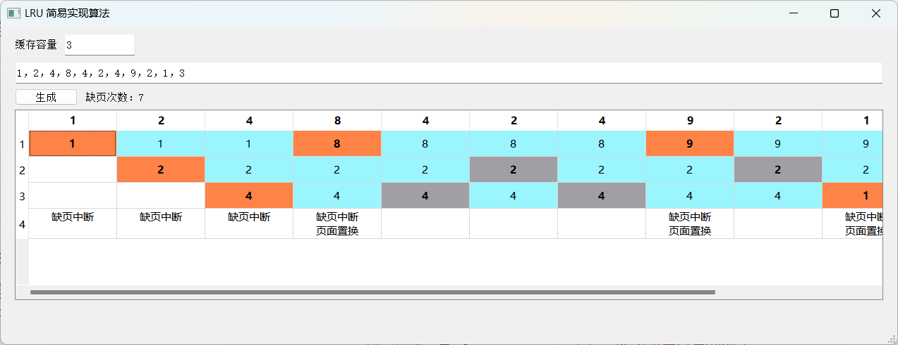

# LRU 算法简易实现 + 图形化界面
## 使用说明
在缓存容量输入框中输入设定好的容量，并在下方输入框中输入要读取的页号，点击生成，就会将使用情况和缺页次数显示在屏幕上，任何非数字字符将被视作分隔符，包括负数的负号和小数中的小数点。
## 运行截图

## LRU 算法逻辑部分
该部分实现于
- ```lru.h```
- ```lru.cpp```

仅包含必要的逻辑实现，不包含任何图形化界面的实现。其实现的大致逻辑如下：使用无序图 + 双向链表实现了简易 HashMap，使用该容器存储页面。任何正要使用的页面将会被放到容器顶部，在容器存放页面数量超限时，自动移除位于容器底部的页面。
## 图形化界面部分
该部分实现于
- ```mainwindow.h```
- ```mainwindow.cpp```
- ```mainwindow.ui```

与 LRU 算法逻辑部分无关。实现了用户输入的有效性检测，尽可能确保不会输入无效数值，同时还增加了缺页次数统计和颜色标记功能。
## 为什么使用 unordered_map 而不是双向链表或者数组？
- 如果使用数组来记录，随机访问的性能好，但在移动或者删除页面的时候，时间开销略大。
    - 如果依赖于页面顺序来查找最近最久未访问的页面，那么每次使用页面均需要将被使用到的页面移动到最顶端。而数组并不适合于移动。
    - 如果依赖于每个页面单独记录的时间来查找最近最久未访问的页面，那么每次使用页面均需要遍历整个数组才能查找到最近最久未使用的页面。
- 如果使用双向链表来记录，移动或者删除页面的性能好，但在访问页面的时候，时间开销较大。
    - 如果依赖于页面顺序来查找最近最久未访问的页面，那么每次查找指定页面的时候，将需要从头或者从尾开始遍历链表才能找到目标页面。当所需要的页面位于查找终点时，时间开销较大。
    - 如果依赖于每个页面单独记录的时间来查找最近最久未使用的页面，那么每次使用页面均需要遍历整个链表才能找到最近最久未使用的页面。

综上考虑，我选择使用 unordered_map 来实现，这样可以保证随机访问、移动和删除页面时的时间复杂度为 $O(1)$。
